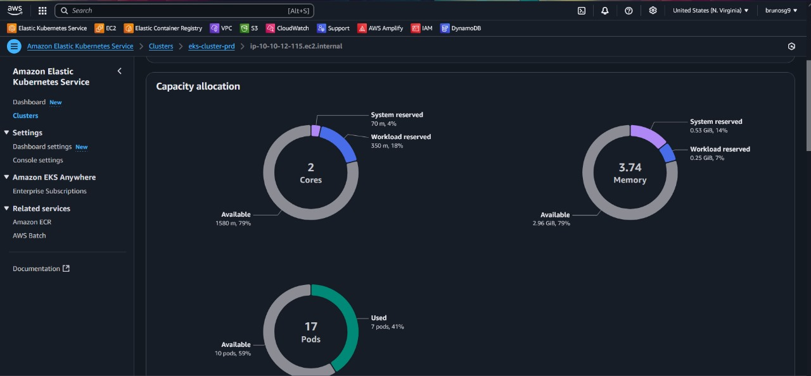
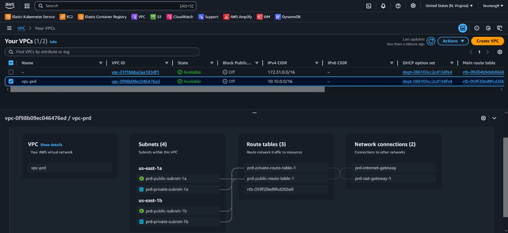
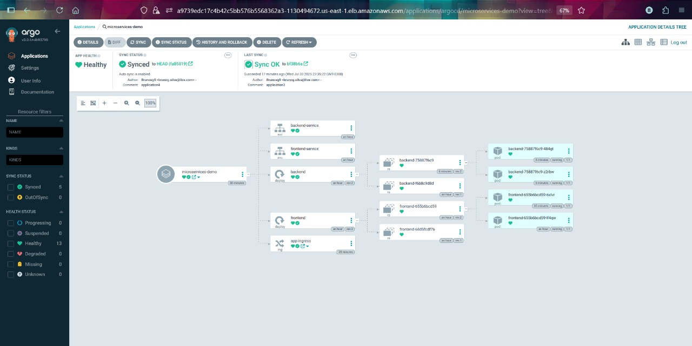
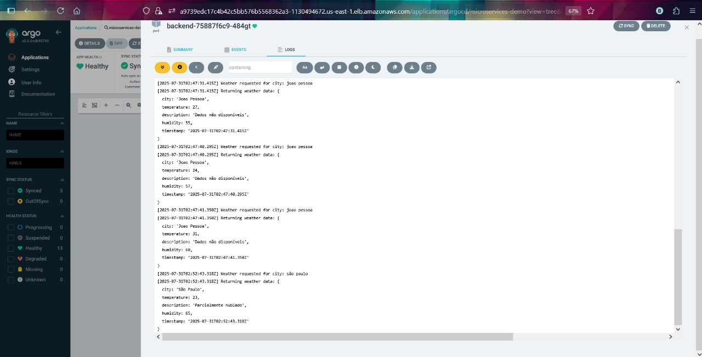
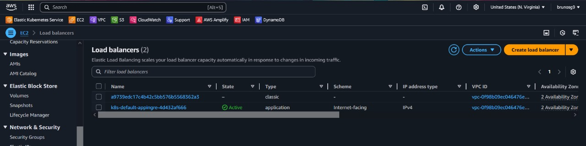
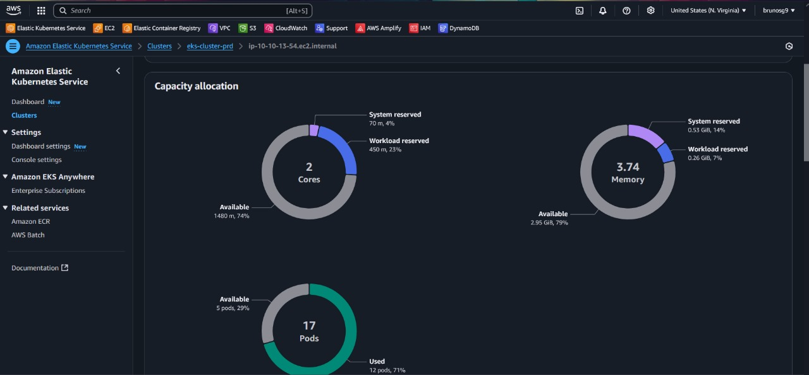
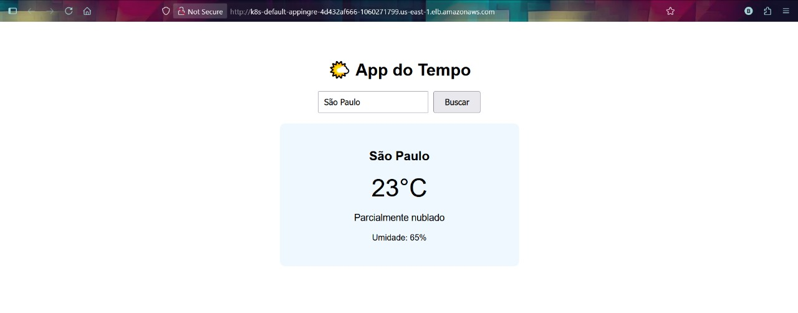

# Projeto EKS com ArgoCD - Demonstração Completa

Este projeto demonstra a implementação completa de um cluster EKS na AWS com ArgoCD para GitOps, incluindo AWS Load Balancer Controller e aplicações de exemplo.

## 🏗️ Arquitetura do Projeto

### Componentes Principais
- **Amazon EKS Cluster** - Cluster Kubernetes gerenciado
- **ArgoCD** - Ferramenta de GitOps para deploy contínuo
- **AWS Load Balancer Controller** - Gerenciamento de ALB/NLB
- **Terraform** - Infraestrutura como código
- **Ansible** - Automação de configuração

## 📸 Demonstração Visual

### 1. Cluster EKS Console AWS

*Console AWS mostrando o cluster EKS eks-cluster-prd ativo com configurações de rede e logging*

### 2. VPC Flow - Arquitetura de Rede

*Diagrama da arquitetura de rede VPC com subnets públicas e privadas para o cluster EKS*

### 3. ArgoCD - Dashboard Principal

*Dashboard do ArgoCD mostrando aplicações kube-system sincronizadas e saudáveis*

### 4. ArgoCD - Detalhes da Aplicação

*Visualização detalhada da aplicação kube-system com todos os recursos deployados*

### 5. ArgoCD - Recursos Kubernetes

*Árvore de recursos Kubernetes gerenciados pelo ArgoCD incluindo ConfigMaps, Secrets e ServiceAccounts*

### 6. AWS Load Balancer Controller

*Pods do AWS Load Balancer Controller em execução no namespace kube-system*

### 7. Aplicação Web Funcionando

*Aplicação web acessível através do Load Balancer, demonstrando o pipeline completo funcionando*

## 🚀 Como Executar

### Pré-requisitos
```bash
# AWS CLI configurado
aws configure

# Terraform instalado
terraform --version

# kubectl configurado
kubectl version

# Ansible instalado
pip install ansible
```

### 1. Deploy da Infraestrutura
```bash
# Inicializar Terraform
cd eks/
terraform init
terraform plan
terraform apply
```

### 2. Configurar kubectl
```bash
aws eks update-kubeconfig --region us-east-1 --name eks-cluster-prd
```

### 3. Executar Ansible
```bash
# Instalar ArgoCD e Load Balancer Controller
ansible-playbook -i inventory.ini ansible.yml -v
```

### 4. Acessar ArgoCD
```bash
# Port forward
kubectl port-forward svc/argocd-server -n argocd 8080:443

# Obter senha admin
kubectl -n argocd get secret argocd-initial-admin-secret -o jsonpath="{.data.password}" | base64 -d
```

## 📁 Estrutura do Projeto

```
terraform-eks/
├── eks/                          # Terraform para EKS
│   ├── eks.cluster.tf           # Configuração do cluster
│   ├── eks.cluster.iam.tf       # IAM roles do cluster
│   └── variable.tf              # Variáveis
├── argocd-applications/         # Aplicações ArgoCD
├── kube-system-manifests/       # Manifests Kubernetes
├── ansible.yml                  # Playbook Ansible
└── .github/workflows/           # CI/CD pipelines
```

## 🔧 Funcionalidades Implementadas

- ✅ **Cluster EKS** com node groups
- ✅ **ArgoCD** para GitOps
- ✅ **AWS Load Balancer Controller**
- ✅ **OIDC Provider** para service accounts
- ✅ **IAM Roles** com políticas específicas
- ✅ **Automação Ansible** completa
- ✅ **CI/CD** com GitHub Actions
- ✅ **Monitoramento** de aplicações

## 🛡️ Segurança

- IAM roles com princípio do menor privilégio
- OIDC para autenticação de service accounts
- Network policies configuradas
- Secrets gerenciados pelo Kubernetes

## 📊 Monitoramento

O projeto inclui configurações para:
- Logs do cluster EKS
- Métricas do ArgoCD
- Status de health das aplicações
- Alertas de sincronização

## 🔄 GitOps Workflow

1. **Código** commitado no repositório
2. **ArgoCD** detecta mudanças
3. **Sincronização** automática
4. **Deploy** no cluster EKS
5. **Monitoramento** contínuo

## 🧹 Limpeza

```bash
# Destruir recursos
terraform -chdir=./eks destroy -auto-approve
```

---

**Projeto desenvolvido com foco em boas práticas de DevOps e GitOps** 🚀